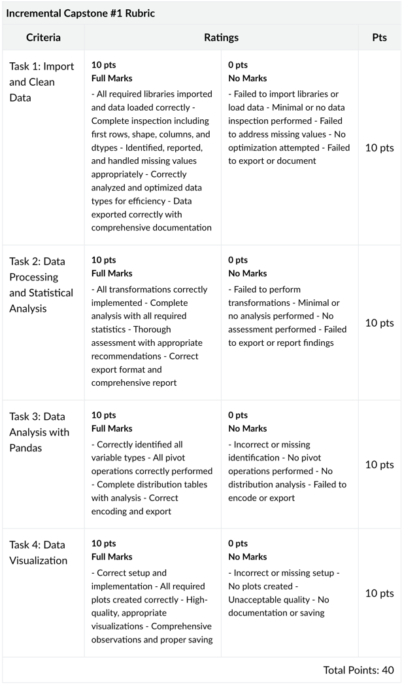

# Class August 18, 2025

- Colton
- Richard
- Anthony
- Sudheer


# Applied Data Science with Python: Incremental Capstone

see: https://fullstack.instructure.com/courses/1248/assignments/75038?module_item_id=405234


## Overview
BikeEase is a New York-based urban mobility company providing bike rental services across the city. The company offers flexible bike rental options to both residents and tourists, aiming to encourage eco-friendly transportation.

BikeEase plans to leverage AI/ML capabilities to optimize operations, predict demand, and improve user experience. The goal is to build an intelligent analytics platform that helps understand rental patterns, seasonal trends, and operational efficiency.

The new platform will focus on:

1. **Demand Forecasting Engine**: Predict rental demand based on historical data and external factors such as weather and seasons
2. **Operational Optimization Engine**: Helps manage bike distribution and maintenance schedules
3. **User Behavior Analysis**: Understand customer preferences and optimize marketing campaigns
4. **Visualization Toolkit**: Provides insights through interactive dashboards for better decision-making

## Project Statement

Develop an end-to-end solution for data aggregation, cleaning, processing, 
and visualization using the provided bike rental dataset. The goal is to extract actionable 
insights to enhance decision-making capabilities.

Create a comprehensive data processing and visualization solution to analyze the bike rental dataset, identify trends,
and provide valuable business insights to BikeEase.

## Objective:

To analyze the given bike rental dataset using Python and relevant libraries to perform data import,
cleaning, processing, statistical analysis, and visualization

Input dataset: [Dataset](https://drive.google.com/file/d/1BAJ8iDpCJdfZSg1QS62RlMiJSs0O8MrG/view?usp=drive_link)

## Data Description

The dataset consists of various features that impact bike rentals, such as weather conditions,
seasonality, and operational factors. Below is a detailed description of the dataset:

- Date: The date when the data was recorded
- Rented Bike Count: The number of bikes rented during the given hour
- Hour: The hour of the day (0-23)
- Temperature(°C): The recorded temperature in Celsius
- Humidity(%): The relative humidity percentage
- Wind speed (m/s): Wind speed measured in meters per second
- Visibility (10m): Visibility recorded in units of 10 meters
- Dew point temperature(°C): The dew point temperature in Celsius
- Solar Radiation (MJ/m2): The amount of solar radiation received
- Rainfall(mm): The recorded rainfall in millimeters
- Snowfall (cm): The recorded snowfall in centimeters
- Seasons: The season when the data was collected (e.g., Winter, Spring, Summer, Fall)
- Holiday: Whether the day was a holiday or not
- Functioning Day: Indicates whether the bike rental service was operational on that day

## Steps to Perform
**Task 1: Import and Clean Data**
1. Import relevant Python libraries for data manipulation and numerical operations:
    - pandas, numpy, matplotlib, seaborn
2. Load the dataset into a Pandas DataFrame from a CSV file.
    - Filename: FloridaBikeRentals.csv
3. Inspect the data:
    - View the first few rows, shape, column names, and data types
    - Identify missing values and inconsistencies
4. Handle missing values and data inconsistencies:
    - Report missing values and suggest appropriate handling techniques (e.g., fill with mean, drop rows, etc.)
    - Check for duplicate records and remove them if necessary
5. Comment on data types and suggest optimizations for memory efficiency.
    - Focus on columns such as Temperature, Humidity(%), Wind speed (m/s)
6. Export the cleaned data to JSON format as bike_rental_cleaned.json
7. Write a short report summarizing observations about the data

**Task 2: Data Processing and Statistical Analysis**
1. Perform transformations:
    - Multiply Temperature by 10 for standardization
    - Scale Visibility to a range between 0 and 1 using MinMax scaling
2. Conduct basic statistical analysis:
    - Use describe() function for key columns like Temperature, Humidity(%), Rented Bike Count
    - Compare the results with raw dataset statistics
3. Identify columns that are not suitable for statistical analysis and recommend possible datatype changes 
4. Export the processed data to a CSV file named bike_rental_processed.csv
5. Prepare a short report on statistical observations and insights

**Task 3: Data Analysis with Pandas**
1. Identify categorical and numerical variables
    - Focus on columns such as Seasons, Holiday, and Functioning Day
2. Perform pivoting operations on the dataset based on categorical columns:
    - Group by Seasons and calculate the average rented bike count
    - Analyze trends across Holiday and Functioning Day
3. Create distribution tables:
    - Temperature and Rented Bike Count distribution by Hour
    - Seasons and Rented Bike Count distribution
4. Encode categorical variables and save data as "Rental_Bike_Data_Dummy.csv"

**Task 4: Data Visualization**
1. Import visualization libraries (matplotlib, seaborn)
2. Select appropriate visualization techniques for the data:
    - Bar plot for average rentals by Seasons
    - Line plot showing hourly rentals throughout the day
    - Heatmap showing correlation among numerical variables
    - Box plot to identify outliers in Temperature and Rented Bike Count
3. Record observations and insights from visualizations
4. Save plots and observations for reporting purposes


## Grading


* * *
## Update 11:36 PM
Guys I was gettings some errors with the original data so I did the following: 

> Used `encoding_errors='ignore' to make Temperature column name 'Temperature(C)'
```
# here
bikes = pd.read_csv('FloridaBikeRentals.csv', encoding_errors='ignore')
# and here
raw_df = pd.read_csv('FloridaBikeRentals.csv', encoding_errors='ignore') #, encoding='latin-1')
```

> see: `logwood/richard_main.ipynb`
> uses original data:  `logwood/FloridaBikeRentals.csv` 